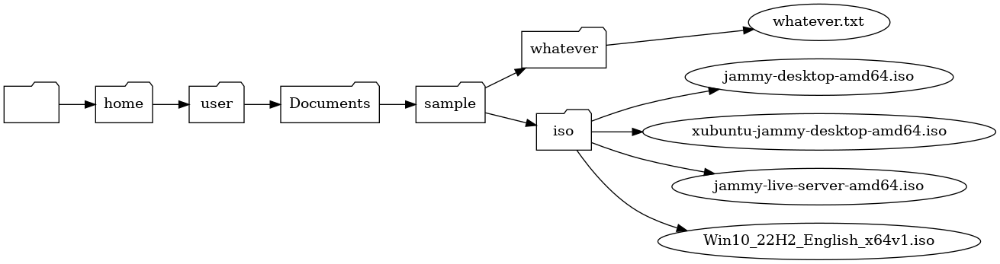

# treegraph
A Python utility to generate the [DOT graph](https://en.wikipedia.org/wiki/DOT_(graph_description_language)) of a Filesystem

Modify the `root_directory` variable with the path of the directory that you want to start the graph from.

Then execute with `python treegraph.py`

The output can be redirected to a file that the [dot utility](https://tracker.debian.org/pkg/graphviz) can use to generate a graph, like so:

```shell
$ python treegraph.py > graph.dot

$ dot -Tpng -o graph.png graph.dot

```



Inspired by [debtree](https://salsa.debian.org/debian/debtree) (also [here](https://tracker.debian.org/pkg/debtree))
